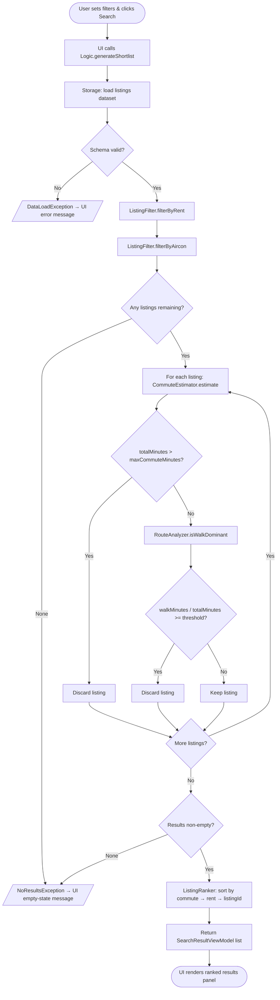
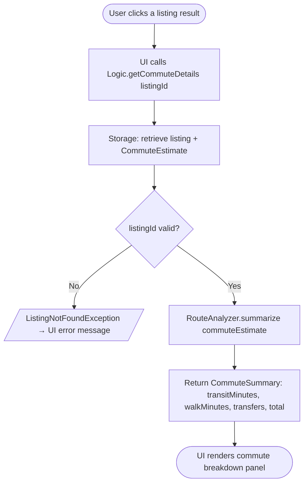

# Software Design Document (SDD)

**Smart Rental Search Algorithm**

## 1. Purpose and Scope

### Goal

A desktop GUI application that helps newcomers to Singapore find rental listings based on a primary destination (e.g., MRT station) and commute constraints, delivered as a runnable JAR.

### In-scope (by the roadmap)

- **V1.2**: Set primary destination + filter by monthly rent
- **V1.3 (MVP)**: Commute time cap + generate shortlist output
- **V1.4 (Alpha)**: Anti-walk-dominant route filter + commute summary breakdown

### Out-of-scope (SDD-level assumptions)

- Live routing APIs (e.g., Google Maps)
- Address geocoding / map rendering
- Real-time rental scraping; user accounts

> *Prof suggested against this by strongly recommending using local data*

Since we use local data, our app will be accurate only up to the last dataset update date, and the UI should display a notice like "Data accurate as of <last-updated date>" based on dataset metadata.

---

## 2. Architecture Overview

**Design decision**: Local data only for routing + listings

### Component View

| Component | Description |
|-----------|-------------|
| **UI (GUI)** | Collects inputs from user, displays ranked results, displays listing details + commute breakdown |
| **Logic** | Sets up the search pipeline and exposes UI-friendly operations |
| **Services** | CommuteEstimator, ListingFilter, ListingRanker, RouteAnalyzer |
| **Model** | Entities (Listing, Station, Preferences, Results) |
| **Storage** | Loads local datasets (stations/edges/listings), optional persistence of preferences for improved UX |

See [Architecture Overview](./architecture.md) for details.

---

## 3. Module Decomposition

### 3.1 UI (GUI)

**Responsibilities**

- Destination selection UI (MRT station picker)
- Filter inputs: max rent, max commute mins, require aircon
- Results list/table: top matches + basic fields
- Details panel/dialog: full listing + commute breakdown (V1.4)

**Outputs**

- User actions → Logic calls
- Rendered `SearchResultViewModel[]`

### 3.2 Logic

**Responsibilities**

- Validate user inputs
- Execute search pipeline (load → filter → estimate → rank)
- Provide view models for UI
- Centralize error handling (user-friendly messages)

**Primary operations**

- `setDestination(stationId)`
- `setPreferences(maxRent, maxCommuteMinutes, requireAircon, transportMode)`
- `generateShortlist()` → `List<SearchResult>`
- `getListingDetails(listingId)` → `ListingDetails`
- `getCommuteDetails(listingId)` → `CommuteEstimate` (V1.4)

### 3.3 Services

| Service | Operations |
|---------|------------|
| **ListingFilter** | `filterByRent(listings, maxRent)`, `filterByAircon(listings, requireAircon)` |
| **CommuteEstimator** | `estimate(fromStationId, toStationId, mode)` → `CommuteEstimate` — Implementation: Dijkstra (adjacency list) on local transit graph |
| **ListingRanker** | Deterministic sorting/scoring (see §5) |
| **RouteAnalyzer** (V1.4) | `isWalkDominant(commuteEstimate)` → `bool`, `summarize(commuteEstimate)` → `CommuteSummary` |

### 3.4 Model (Domain)

Immutable-ish entities; lightweight DTOs between layers.

### 3.5 Storage (Local Data)

- `StationRepository` (stations file)
- `TransitGraphRepository` (edges file)
- `ListingRepository` (listings file)
- Optional: `UserPrefsRepository` (save last-used preferences)

---

## 4. Data Model

### 4.1 Entities

| Entity | Fields |
|--------|--------|
| **Station** | `stationId: String`, `name: String`, `lines: Set<String>` |
| **Edge** | `fromStationId: String`, `toStationId: String`, `travelMinutes: int`, `line: String` |
| **TransitGraph** | `adj: Map<String, List<Edge>>` |
| **RentalListing** | `listingId: String`, `title: String`, `monthlyRent: int`, `hasAircon: boolean`, `nearestStationId: String`, optional: `address`, `roomType`, `notes` |
| **UserPreferences** | `destinationStationId: String`, `maxRent: int`, `maxCommuteMinutes: int`, `requireAircon: boolean`, `transportMode: enum` (MVP default: MRT) |
| **CommuteEstimate** | `totalMinutes: int`, `transitMinutes: int`, `walkMinutes: int` (0 for MRT-only MVP), `transfers: int`, `routeStations: List<String>` |
| **SearchResult** | `listing: RentalListing`, `commute: CommuteEstimate`, `score: double` |

### 4.2 Relationships

- `RentalListing.nearestStationId` → `Station.stationId`
- `UserPreferences.destinationStationId` → `Station.stationId`
- TransitGraph contains Stations and Edges
- SearchResult composes RentalListing + CommuteEstimate

---

## 5. Core Workflows

### Workflow A — Set Primary Destination (V1.2)

1. User selects destination MRT station in GUI.
2. UI calls `Logic.setDestination(stationId)`.
3. Logic stores `destinationStationId` in `UserPreferences`.
4. (Optional) Storage persists preferences for improved UX.

### Workflow B — Generate Shortlist (MVP V1.3)

1. User sets maxRent, maxCommuteMinutes, requireAircon and clicks Search.
2. UI calls `Logic.generateShortlist()`.
3. Logic loads listings (Storage).
4. ListingFilter applies rent + aircon filters.
5. For each remaining listing: `CommuteEstimator.estimate(listing.nearestStationId, destinationStationId, 'MRT')` — discard if `totalMinutes > maxCommuteMinutes`.
6. In V1.4, `RouteAnalyzer.isWalkDominant()` discards routes where `walkMinutes / totalMinutes` is greater than or equal to the configured threshold.
7. ListingRanker computes score and sorts results.
8. UI displays ranked results.



### Workflow C — Commute Breakdown (V1.4)

1. User opens listing details (click result).
2. Logic returns CommuteEstimate + route summary.
3. `RouteAnalyzer.summarize()` formats the transit, walking, transfer, and total-time breakdown.
4. UI displays breakdown: transit vs walking, transfers, total time.


---

## 6. Ranking and Scoring (Deterministic)

**Default sort** (for stability; dataset shouldn't be too large):

1. Lowest `commute.totalMinutes`
2. Lowest `listing.monthlyRent`
3. Tie-breaker: `listingId` (stable ordering)

**Optional score function** (for display):

```
score = w1 * (normalizedCommute) + w2 * (normalizedRent)
```

(weights fixed in config)

---

## 7. Constraints and Assumptions

### Constraints

- MVP runs offline
- GUI required for all core user flows
- Deliverable must be runnable as a JAR
- Data loaded from local files (JSON/CSV); schema must be validated on load

### Assumptions

- Destination is represented as an MRT station (finite set)
- Each listing provides `nearestStationId` (no geocoding in MVP)
- Commute times are approximations derived from local transit graph edge weights
- MVP transport mode defaults to MRT; walking modeled minimally (V1.4)

---

## 8. Risks and Mitigations

| Risk | Impact | Mitigation |
|------|--------|------------|
| Local dataset incomplete/inconsistent | Empty/incorrect results | Schema validation + curated demo dataset + clear load errors |
| Routing bugs (shortest path) | Wrong commute times | Unit tests with small graphs; deterministic fixtures |
| GUI scope creep | Time blow-up | Minimal screens: Search + Results + Details dialog |
| UI–Logic coupling | Integration pain | Strict interfaces + view models; no domain logic in UI |
| Performance with many listings | Slow search | Cache shortest paths per destination; precompute station-to-destination distances |
| Ambiguous "walk-dominant" definition | Feature disagreement | Define threshold (e.g., `walkMinutes / totalMinutes >= T`) in config and document it |
