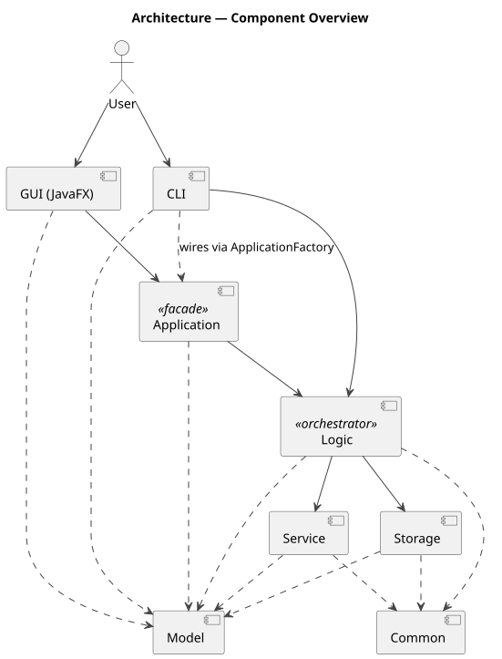
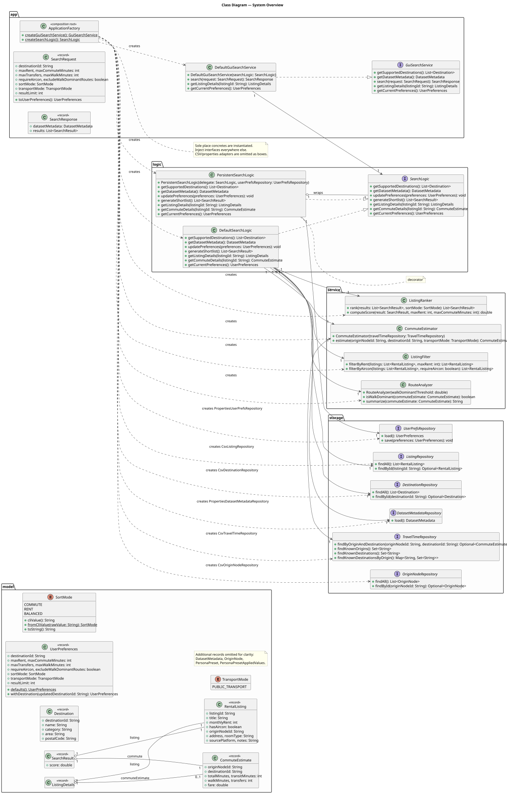
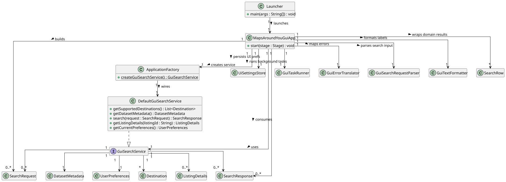
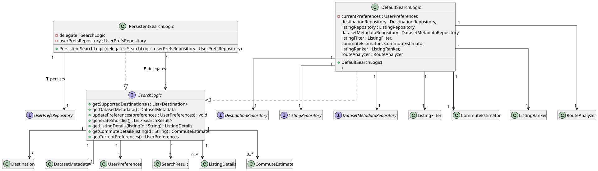
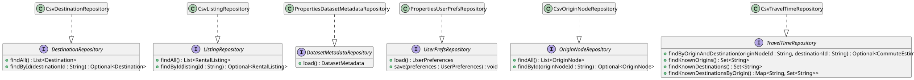
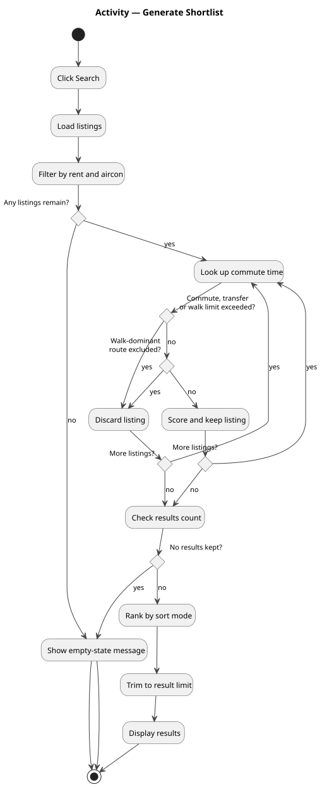
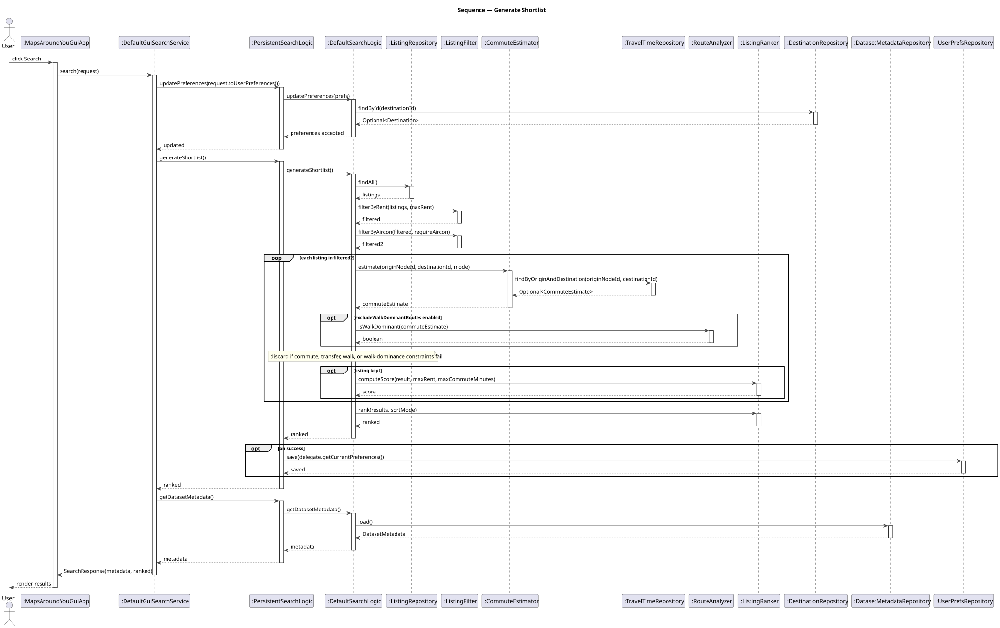
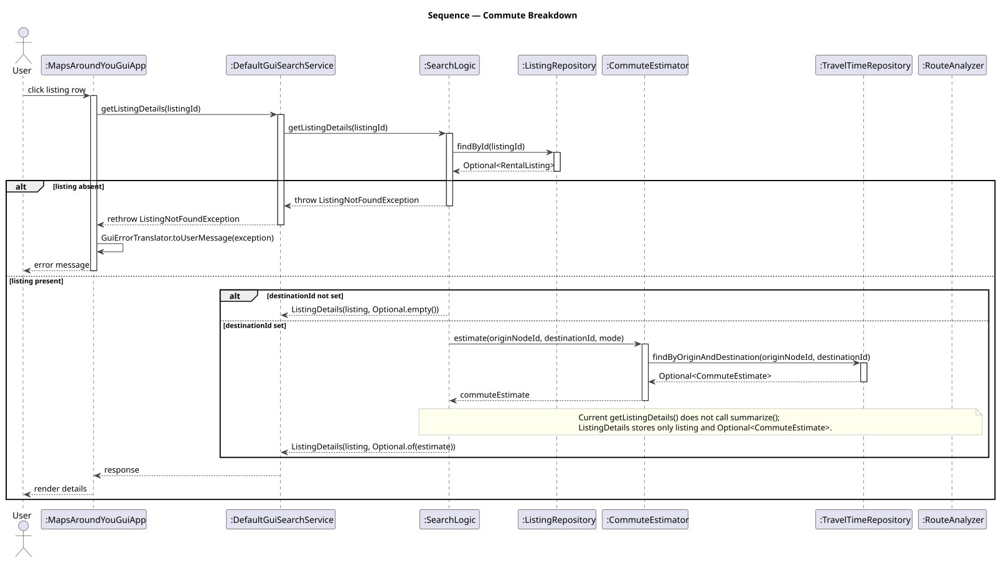

# MapsAroundYou — Developer Guide

## Table of Contents

1. Prerequisites
2. Setting up, building, and testing
3. Architecture
4. Architecture & Coupling
5. Class Diagram
6. Implementation
7. Testing
8. Contribution workflow
9. Extension guidance
10. Common pitfalls & review checklist
11. Appendix

---

## 1. Prerequisites

- Java 21 (x86_64 / AMD64) on `PATH` or in `JAVA_HOME`
- JavaFX 21.0.2 (pulled automatically via Gradle)
- Gradle Wrapper (`./gradlew` / `.\gradlew`) — no system Gradle needed
- Supported operating systems: Windows, macOS, Linux
- To regenerate PlantUML diagrams: a Java runtime plus `tools/plantuml.jar` (auto-downloaded by the render script)

## 2. Setting up, building, and testing

Clone:

```bash
git clone https://github.com/cs2103de-tp/MapsAroundYou.git && cd MapsAroundYou
```

Build:

```bash
./gradlew build
```

Run the JavaFX GUI:

```bash
./gradlew runGui
```

Run tests:

```bash
./gradlew test
```

Run the local quality gate (Checkstyle + SpotBugs + tests):

```bash
./gradlew clean check
```

Regenerate UML diagrams after editing `docs/assets/diagram_images/*.puml`:

- Linux / macOS: `bash scripts/render-diagrams.sh`
- Windows: `scripts\render-diagrams.bat`

## 3. Architecture



The app is a layered JavaFX application. User input flows down the layers through interfaces only:

- **GUI / CLI** — entrypoints. GUI talks to the `app.GuiSearchService` facade; CLI talks to `logic.SearchLogic` directly.
- **Application (`mapsaroundyou.app`)** — thin facades and the `ApplicationFactory` composition root. GUI never sees `SearchLogic`.
- **Logic (`mapsaroundyou.logic`)** — orchestrates the search pipeline; holds no JavaFX, no I/O.
- **Service** — stateless helpers: `CommuteEstimator`, `ListingFilter`, `ListingRanker`, `RouteAnalyzer`.
- **Storage** — repository interfaces with CSV/properties adapters.
- **Model** — records and enums shared across layers.

## 4. Architecture & Coupling

Issue #46 — low coupling is a first-class design goal. This section documents the rules so contributors maintain the property as the codebase grows.

### Dependency direction

`gui → app → logic → service + storage`. The GUI crosses into `app` through the `GuiSearchService` facade, and `logic` crosses into `storage` through repository interfaces. Service helpers (`ListingFilter`, `CommuteEstimator`, `ListingRanker`, `RouteAnalyzer`) are concrete classes today but are injected into `DefaultSearchLogic` via constructor, so a future contributor can introduce interfaces without rewiring callers. Never import `storage.*` or `service.*` from `gui.*`.

### Composition root

`ApplicationFactory` ([src/main/java/mapsaroundyou/app/ApplicationFactory.java](../src/main/java/mapsaroundyou/app/ApplicationFactory.java)) is the **only** place where concrete classes are instantiated. Its two public static factory methods — `createGuiSearchService()` and `createSearchLogic()` — return interface types. Adding a new concrete? Wire it in `ApplicationFactory` and nowhere else.

### Interface-based injection

`DefaultSearchLogic` takes 7 dependencies via constructor injection, all as interface types (`ListingRepository`, `DestinationRepository`, `DatasetMetadataRepository`, `ListingFilter`, `CommuteEstimator`, `ListingRanker`, `RouteAnalyzer`). Unit tests can supply fakes without touching storage.

### Decorator pattern

`PersistentSearchLogic` wraps any `SearchLogic`, adding preference persistence on success via `UserPrefsRepository`. The GUI cannot tell the decorator apart from the plain delegate — identical interface.

### GUI facade

`app.GuiSearchService` is a narrow facade. The GUI never sees `SearchLogic`, `SearchResult`, `CommuteEstimate` construction, or repository types directly. This keeps the JavaFX layer insulated from logic changes.

### Rules for maintaining coupling

1. Inject interfaces, never concretes.
2. Register new concrete classes only in `ApplicationFactory`.
3. Do not import `mapsaroundyou.storage.*` or `mapsaroundyou.service.*` from `mapsaroundyou.gui.*`.
4. Facades (`app`) stay thin — no business logic.
5. Adding a new repository? Define the interface in `storage`, add a CSV adapter, wire it in `ApplicationFactory`, inject it via constructor into the needing class.

## 5. Class Diagram



Highlights:

- Interfaces render with the `interface` keyword and realize arrows `..|>` from concretes.
- `ApplicationFactory` is stereotyped `<<composition root>>` and is the only node with dashed `<<creates>>` arrows to concretes.
- `PersistentSearchLogic` is stereotyped `<<decorator>>` and composes a `SearchLogic` via aggregation.
- Multiplicities are present on every association.

### 5.1 Layer Class Diagrams

The diagrams below drill into individual layers.

**GUI layer** — entry points, facade wiring, and helper utilities:



**Logic layer** — `SearchLogic` interface, `DefaultSearchLogic` with 7 injected dependencies, and `PersistentSearchLogic` decorator:



**Storage layer** — repository interfaces and their CSV/properties adapters:



## 6. Implementation

### Entry points

- **GUI**: `gui.Launcher` → `gui.MapsAroundYouGuiApp` (JavaFX) → `ApplicationFactory.createGuiSearchService()`.
- **CLI**: `cli.MapsAroundYouApp` → `ApplicationFactory.createSearchLogic()` → `cli.CliApplication`.

### Feature — Generate Shortlist

Activity view:



Sequence view:



Implementation hotspots:

- `logic.DefaultSearchLogic.generateShortlist()` — pipeline: load → filter → estimate → score → rank → truncate
- `service.CommuteEstimator` — looks up `TravelTimeRepository` by `(originNodeId, destinationId)`
- `service.RouteAnalyzer.isWalkDominant()` — optional per-route rejection
- `logic.PersistentSearchLogic` — decorator saves preferences after a successful shortlist

### Feature — Commute Breakdown



Implementation hotspots:

- `logic.DefaultSearchLogic.getListingDetails(listingId)` — returns `ListingDetails(listing, Optional<CommuteEstimate>)`
- `gui.GuiErrorTranslator` — maps exceptions to user-facing messages
- `app.DefaultGuiSearchService` — rethrows domain exceptions so the GUI can translate them consistently

## 7. Testing

- **Framework**: JUnit 5 (Jupiter).
- **Layout**: `src/test/java/mapsaroundyou/**` mirrors `src/main/java/mapsaroundyou/**`.
- **Run all tests**: `./gradlew test`
- **Run one test class**: `./gradlew test --tests mapsaroundyou.logic.DefaultSearchLogicTest`
- **Quality gate**: `./gradlew check` adds Checkstyle + SpotBugs on top of tests; must pass before any PR is mergeable.
- New features should ship with unit tests for all non-trivial logic and integration-style tests at the `DefaultSearchLogic` or `DefaultGuiSearchService` seam.

## 8. Contribution workflow

This project uses a fork-based workflow. See [docs/development/fork-workflow.md](development/fork-workflow.md) for the canonical setup; this section is the short version.

1. Fork `cs2103de-tp/MapsAroundYou` on GitHub.
2. Clone your fork and add the upstream remote:
   - `git remote add upstream https://github.com/cs2103de-tp/MapsAroundYou.git`
3. Sync: `git fetch upstream && git checkout main && git merge --ff-only upstream/main`.
4. Create a feature branch: `git checkout -b feature/<short-description>`.
5. Make changes in small, focused commits — follow [docs/development/git-commit-conventions.md](development/git-commit-conventions.md).
6. Push to your fork and open a PR against `cs2103de-tp/MapsAroundYou:main`.
7. Before pushing, run the local quality gate: `./gradlew clean check` (Checkstyle + SpotBugs + tests).
8. On GitHub, the `PR Quality Gate` status must turn green. It aggregates `PR Quality Check` (Checkstyle + SpotBugs + tests on Ubuntu), the cross-OS `PR Build Gate` runnable-JAR builds for Linux / macOS / Windows on Temurin 21 x64, and `PR File Hygiene`.
9. Request at least one approving review before merging.

## 9. Extension guidance

### Adding a new service (e.g., a new filter)

1. Define the new operation in `service/` — single-responsibility class, no state.
2. Add it as a constructor parameter of `DefaultSearchLogic` (interface type if multiple implementations anticipated).
3. Wire it in `ApplicationFactory.createSearchLogic()`.
4. Unit-test it in isolation.

### Adding a new repository

1. Define the interface in `storage/` (e.g., `storage.ReviewRepository`).
2. Add a CSV adapter (e.g., `storage.CsvReviewRepository`).
3. Wire it in `ApplicationFactory`.
4. Inject into the consumer via constructor — never `new CsvReviewRepository()` outside the factory.

### Adding a new GUI filter field

1. Add the field to `app.SearchRequest` and to `model.UserPreferences`.
2. Update `gui.GuiSearchRequestParser` to read the new field from the JavaFX form.
3. Update `DefaultSearchLogic` to honour the new preference.
4. Update the activity/sequence diagrams if the control flow changes.

## 10. Common pitfalls & review checklist

- [ ] Did you add a new concrete outside `ApplicationFactory`? Move it.
- [ ] Did you import `storage.*` or `service.*` from `gui.*`? Don't — go through `app.GuiSearchService`.
- [ ] Did you add a field AND an association line in a class diagram for the same relationship? Pick one.
- [ ] Did you use `alt` for a single-branch construct? Use `opt` instead in sequence diagrams.
- [ ] Did you re-render after editing a `.puml`? Run the render script.
- [ ] Did you update `./gradlew check`? It must pass locally.
- [ ] Did you run Checkstyle and SpotBugs? They run with `./gradlew check`.

## 11. Appendix

- [Software Design Document (SDD)](design/sdd.md)
- [Architecture Overview](design/architecture.md)
- [API Specification](api/api-spec.md)
- [Architecture Decision Records (ADRs)](design/adr/)
- [User Guide](UserGuide.md)
- [Fork workflow](development/fork-workflow.md)
- [Commit conventions](development/git-commit-conventions.md)
